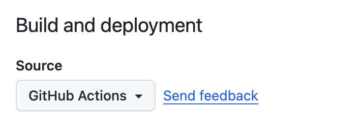
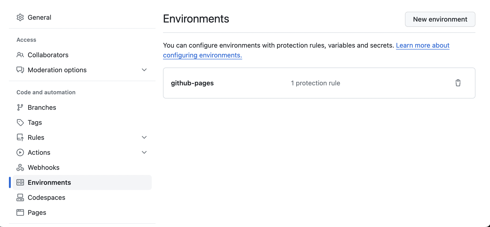

# template ts preact htm 

A template for *dependency* modules using `preact`, `htm`, and typescript. Uses `tape-run` for tests in a browser environment. See [template-ts](https://github.com/nichoth/template-ts) for something similar but targeting Node.

## use
1. Use the template button in github. Or clone this then `rm -rf .git && git init`. Then `npm i && npm init`.

2. Edit the source code in `src/index.ts`.

## featuring

* compile the source to both ESM and CJS format, and put compiled files in `dist`.
* ignore `dist` and `*.js` in git, but don't ignore them in npm. That way we don't commit any compiled code to git, but it is available to consumers.
* use npm's `prepublishOnly` hook to compile the code before publishing to npm.
* use `exports` field in `package.json` to make sure the right format is used by consumers.
* `preversion` npm hook -- lint via `standardx`.
* `postversion` npm hook -- `git push && git push --tags && npm publish`
* eslint via [standardx](https://www.npmjs.com/package/standardx) -- `npm run lint`
* tests run in a browser environment via `tape-run` -- see `npm test`. Includes `tap` testing tools -- [tapzero](https://github.com/nichoth/tapzero) and [tap-arc](https://www.npmjs.com/package/tap-arc)
* CI via github actions
* Deploy a demo webpage on any push event to the main branch. This will build the `example` directory and deploy it to your `github.io` site.

## demo
Use [a link like this](https://nichoth.github.io/template-ts-preact-htm/) to see a demo page, built from the `example` directory.

This means you need to configure some things in github to make github pages work. In the gihub UI, you need to go to `settings` > `Pages`, and choose `Github Actions` in the `Build and Deployment` source.

Also you should go `settings` > `Environments`, and create an environemnt `gh-pages`.

